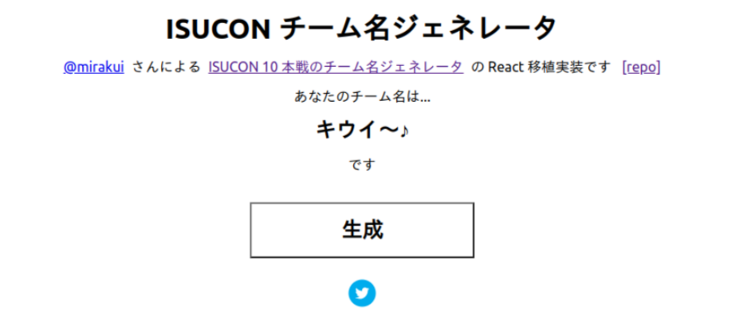
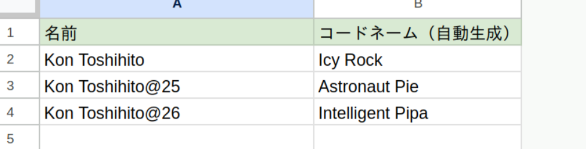
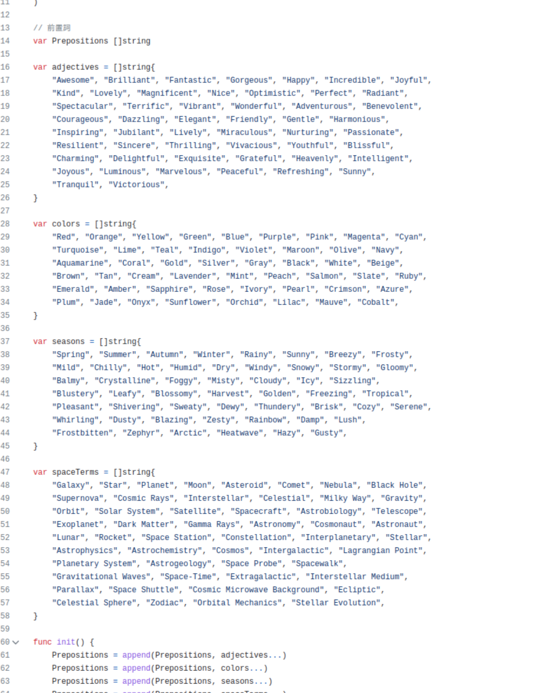

# **codename-generator**

文字列からかっこよさそうなコードネームを生成してくれる
CLI tool and Golang Library

Author: Toshihito Kon

---

# **demo**

CLIツールとして

```
 0 (*>△<) % codename-generator --generator-version 1 "codename-generator@v1.0.0"
Tan Starburst

 0 (*>△<) % codename-generator --generator-version 1 "codename-generator@v1.0.1"
 Ruby Sunset
```

WebAPIとして

```bash
 0 (*>△<) % curl 'https://codename-generator-xxxxx.a.run.app?generator-version=1&text=codename-generator@v1.0.0'
Tan Starburst
```

---

## Usage (CLI)

```bash
 % codename-generator --generator-version 1 "product-name:v1.0.0"
Spring Praline
```

or

```bash
 % echo "product-name:v1.0.0" | codename-generator --generator-version 1
Spring Praline
```

---

## Install (CLI)

Use `go install`

```
 % go install github.com/ToshihitoKon/codename-generator@latest
```

or

Download Binary

https://github.com/ToshihitoKon/codename-generator/releases/tag/v1.0.0

---

## Usage (WebAPI)

Pull Container Image from dockerhub and run
https://hub.docker.com/repository/docker/toshihitokon/codename-generator/general

```bash
 % docker run -it --rm -e "PORT=8000" -p 8000:8000 toshihitokon/codename-generator:v1
```

```bash
 % curl 'localhost:8000?generator-version=1&text=product-name:v1.0.0'
Spring Praline
```

---

# **Motivation**

- `v1.1.1`と`v1.0.1`を見間違えてデプロイミスしそうになるヒヤリハット
- AndroidのKitKatやらMarshmallowみたいなコードネームがついていればチェック漏れしづらいか
- デプロイバージョン毎に毎回生成して共有するのも難しいので、テキストから一意な名前が生成されてほしい

---

# **Motivation**

デプロイ手順書で勝手にコードネームが横についてくる
commit hashやversionをベースにすれば何度生成しても同じなので、チーム内で共有する必要がない

---

<style scoped>
img[alt~="center"]{
    display: block;
    margin: 0 auto;
}
</style>

# Inspired by

[ISUCON チーム名ジェネレーター](https://isucon-team-name-generator.netlify.app/)


---

# **Sample**

二つ名作るのに使える

```
0 (*>△<) % codename-generator --generator-version 1 "Kon Toshihito"
Icy Rock
```

`Icy Rock`です、かっこいい

---

# **Sample**

年齢ごとにコードネームつくれる

```
0 (*>△<) % codename-generator --generator-version 1 "Kon Toshihito@25"
Astronaut Pie
```

25歳のぼく、`Astronaut Pie`です

---

# **Sample**

年齢ごとにコードネームつくれる

```
0 (*>△<) % codename-generator --generator-version 1 "Kon Toshihito@26"
Intelligent Pipa
```

来年のぼくは`Intelligent Pipa`です
流石に仰々しいね

---

# **Sample**

スプレッドシートと連携させる

Docker ContainerをGCP CloudRunにデプロイしてGASからAPIを叩く

```js
function fetchCodename(name) {
    const baseUrl = "https://codename-generator-xxxxx.a.run.app"
    const response = UrlFetchApp.fetch(`${baseUrl}?generator-version=1&text=${name}`)
    return response.getContentText()
}
```
---

# **Sample**

スプレッドシートと連携させる



---

# **制作話**

生成するワードは全部コードの中に列挙されています

fakerなどランダムなワードを生成するライブラリはありますが、コードネームらしい文字列を出すのは難しい



---

# **制作話**

ChatGPTくんに全部生成してもらいました

- コードネームに使われるワードでよくある種類を教えて
- 色の名前を英語で50個ほど、Goの配列で出力して
- 英語のポジティブな形容詞を50個ほどGoの配列で出力して

返ってきたものをコピペしたりして完成
